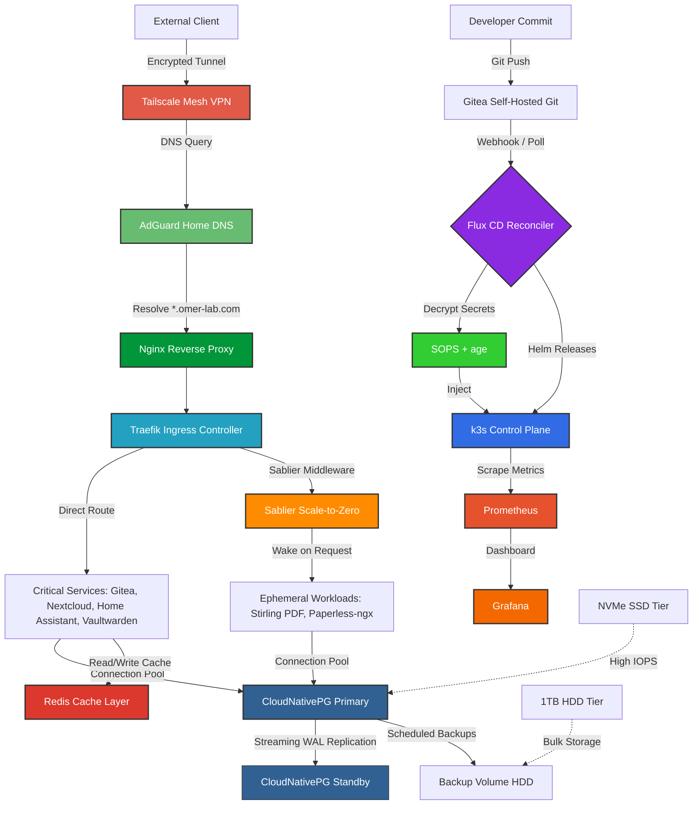

<a href="https://github.com/omerharuncetin">
  
</a>

```yaml
apiVersion: rbac.authorization.k8s.io/v1
kind: EngineerRole
metadata:
  name: omer-harun-cetin
  namespace: platform-engineering
spec:
  title: "Distributed Systems"
    experience: "5+ years Software Engineering"
  current_focus:
    - Kubernetes
    - Confidential Computing
    - Resource Optimization 
    - Scalable & Robust Systems
```

### ⚙️ Engineering Philosophy & Featured Work

I build secure, automated infrastructure using GitOps and CI/CD principles. My homelab project, **[omer-lab](https://github.com/omerharuncetin/homelab)**, is a production-grade Cloud Native datacenter built entirely from code. 

**Core capabilities implemented in `omer-lab`:**
* **Continuous Reconciliation:** Flux CD state enforcement.
* **Secrets Management:** In-cluster SOPS & age decryption.
* **Smart Scaling:** Sablier scale-to-zero routing to optimize RAM constraints.
* **Resilient Data:** CloudNativePG operator handling Postgres failovers.

<details>
<summary><b>🗺️ Click to view my Homelab Architecture</b></summary>




</details>

---

### 🛠️ Technical Arsenal

| Domain | Technologies |
| :--- | :--- |
| **Languages** |     |
| **Cloud & OS** |   |
| **Orchestration** |     |
| **GitOps & IaC** |     |
| **Secrets & Security** |   |
| **Networking & DBs**|       |
| **Observability** |   |

---

### 📬 Establish Connection

[](https://linkedin.com/in/omerharuncetin)
[](mailto:omerharuncetin@gmail.com)

